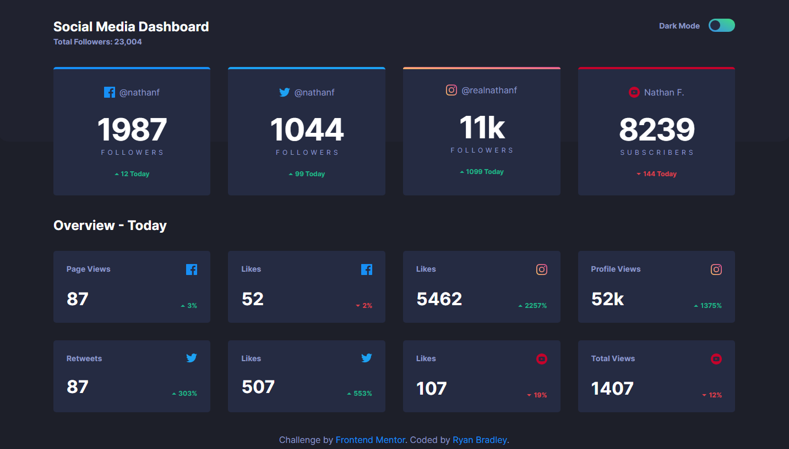
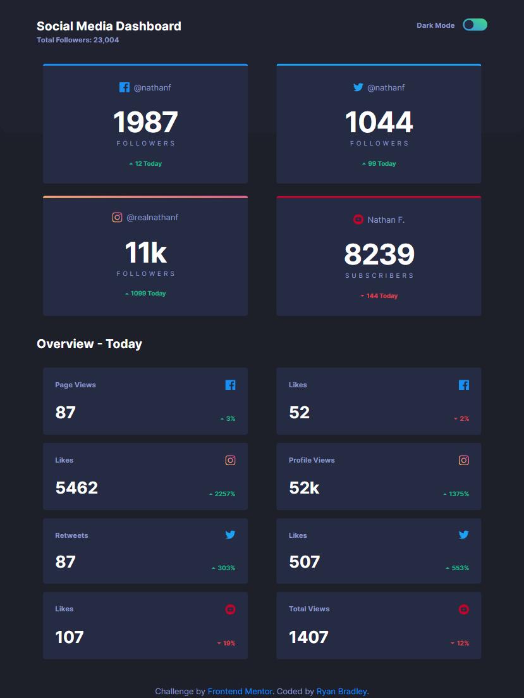
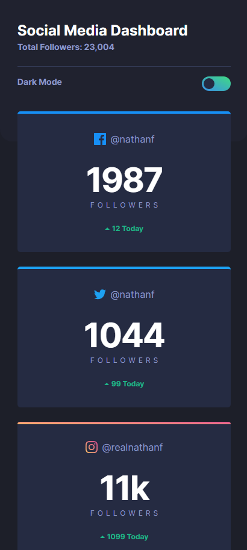

# Frontend Mentor - Social media dashboard with theme switcher solution

This is a solution to the [Social media dashboard with theme switcher challenge on Frontend Mentor](https://www.frontendmentor.io/challenges/social-media-dashboard-with-theme-switcher-6oY8ozp_H). Frontend Mentor challenges help you improve your coding skills by building realistic projects. 

## Table of contents

- [Overview](#overview)
  - [The challenge](#the-challenge)
  - [Screenshot](#screenshot)
  - [Links](#links)
- [My process](#my-process)
  - [Built with](#built-with)
  - [What I learned](#what-i-learned)
  - [Continued development](#continued-development)
  - [Useful resources](#useful-resources)
- [Author](#author)
- [Acknowledgments](#acknowledgments)

**Note: Delete this note and update the table of contents based on what sections you keep.**

## Overview

### The challenge

Users should be able to:

- View the optimal layout for the site depending on their device's screen size
- See hover states for all interactive elements on the page
- Toggle color theme to their preference

### Screenshot







### Links

- Solution URL: [GitHub Repository](https://github.com/ryanbradley-webdev/social-media-dashboard)
- Live Site URL: [Site hosted at Netlify](https://social-media-dashboard-rb.netlify.app/)

## My process

### Built with

- Semantic HTML5 markup
- CSS custom properties
- Flexbox
- CSS Grid
- Mobile-first workflow

Due to the simplistic nature of this design, I chose to stick with vanilla HTML/CSS/JS to ensure the simplest possible process for building.

I used grid as the main structure for the cards in both sections, while I used flexbox to position just about every element on the page.

### What I learned

There were a couple of things I had to research to figure out, and a couple of things that were more of a "trial and error" approach to implement.

First, for overall page positioning I was initially struggling with getting the footer to stay at the bottom regardless of the size of the header/main elements. Ultimately I found that using flexbox on the body with a flex-direction of column was the answer. 

Specifically, this is how I ensured that all elements would appear as desired without sacrificing the positioning that I had already established:

```css
body {
    ...
    min-height: 100vh;
    min-height: 100dvh;
    display: flex;
    flex-direction: column;
    ...
}

main {
    flex-grow: 1;
}

footer {
    height: fit-content;
    padding: 0.5rem;
    text-align: center;
}
```

This ensured that the body would take up all extra space on the page while the header and footer were locked at the absolute top/bottom of the page, respectively. The height of 100vh also ensures that the page will always take up at least the entire viewport.

### Continued development

In the future I want to find more reasons to use CSS grid in my projects. Flexbox has been extremely effective at positioning on the page, but it's to the point where I almost always default to its use. My understanding of grid and all its attributes is still very much at a low level, so I hope to expand on that knowledge and implement it in an effective manner soon.

## Author

- Website - [Ryan Bradley](https://ryanbradleyportfolio.com)
- Frontend Mentor - [@ryanbradley-webdev](https://www.frontendmentor.io/profile/ryanbradley-webdev)
- Instagram - [@ryanbradley_webdev](https://www.instagram.com/ryanbradley_webdev/)
- Facebook - [Ryan Bradley Web Development](https://www.facebook.com/ryanbradleywebdev/)
- Facebook - [GitHub Repository](https://github.com/ryanbradley-webdev/)
- Dribbble - [Dribbble Profile](https://dribbble.com/ryanbradley-webdev)